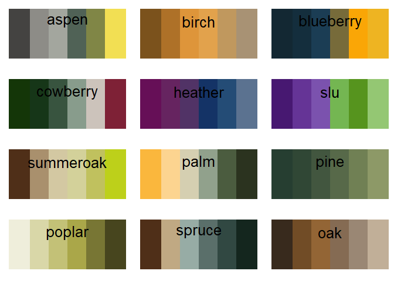
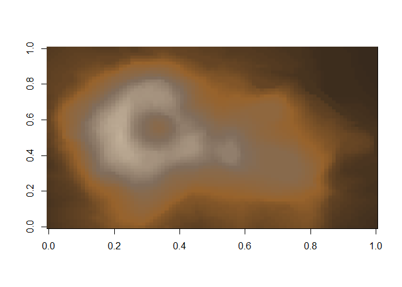
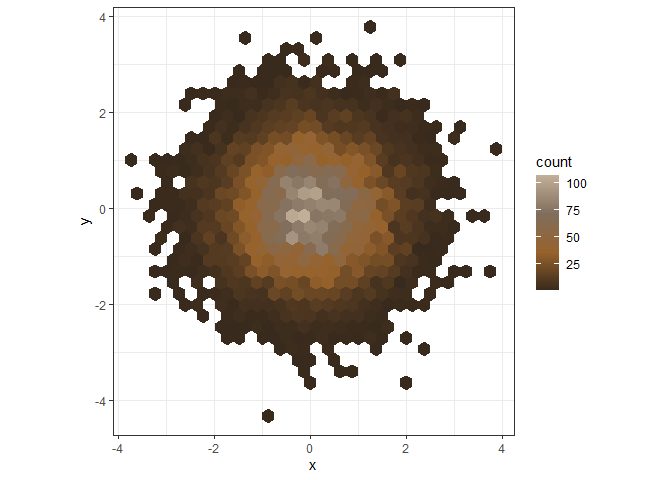
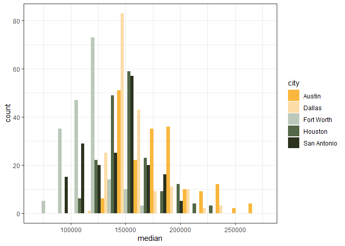
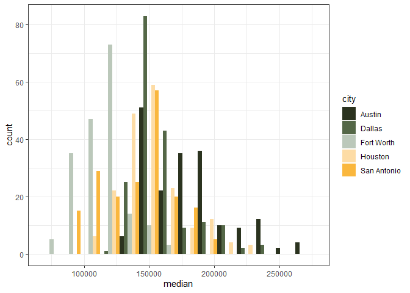

<!-- README.md is generated from README.Rmd. Please edit that file -->
<!-- badges: start -->
<!-- badges: end -->

This is a package designed to implement color palettes for the SSFRC
into `R` and `ggplot2`.  
The package draws some inspiration from the `gameofthrones`-package.

For questions or suggestions please contact me:

Email: <graflukas57@gmail.com>

Twitter: <https://twitter.com/graf_gruen>

## Installation

From Github:

``` r
# install.packages("devtools")
devtools::install_github("graflukas138/sydskog")
```

From CRAN:

``` r
install.packages("sydskog")
```

## Palettes

An overview can be viewed with the `sydskog_colors()` function:

``` r
library(sydskog)

sydskog_colors()
```

<!-- -->

# Usage

An example of usage for the `sydskog` - color scales. The default option
is oak.

``` r
pal <- sydskog(255, option = "oak")
image(volcano, col = pal)
```

<!-- -->

## ggplot2

`sydskog` provides color scales and functions to use with `ggplot2`.  
If `ggplot2` is available you’ll have access to the
`scale_[colour|fill]_sydskog()` functions:

### Continous data

``` r
ggplot(data.frame(x = rnorm(10000), y = rnorm(10000)), aes(x = x, y = y)) +
  geom_hex() + coord_fixed() +
  scale_fill_sydskog(option="oak") + theme_bw()
```

<!-- -->

### Discrete data

Use `scale_fill_sydskog_d()` to plot discrete data.

``` r
txsamp <- subset(txhousing, city %in%
  c("Houston", "Fort Worth", "San Antonio", "Dallas", "Austin"))

ggplot(txsamp, aes(x = median, fill = city)) +
  geom_histogram(position = "dodge", binwidth = 15000)+ scale_fill_sydskog_d(option = "oak")+ theme_bw()
```

<!-- -->

Order of colors can be reversed using `direction = -1`.

``` r
txsamp <- subset(txhousing, city %in%
  c("Houston", "Fort Worth", "San Antonio", "Dallas", "Austin"))

ggplot(txsamp, aes(x = median, fill = city)) +
  geom_histogram(position = "dodge", binwidth = 15000)+ scale_fill_sydskog_d(option = "oak", direction = -1) + theme_bw()
```

<!-- -->
